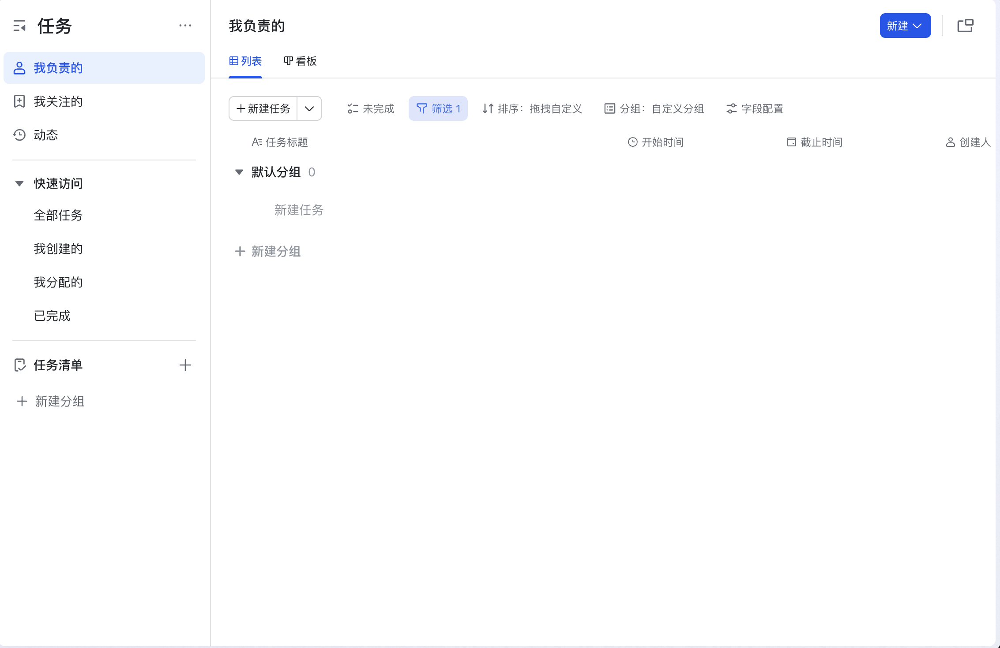

# TodoList Application

一个功能完整的任务管理系统，参考 Lark 任务功能实现。支持团队协作、任务分配、子任务、历史记录等功能。



## 技术栈

### 后端
- **框架**: NestJS (TypeScript)
- **数据库**: MySQL 8.0
- **ORM**: TypeORM
- **认证**: JWT (JSON Web Token)
- **API 文档**: Swagger/OpenAPI
- **容器化**: Docker

### 前端
- **框架**: React 18 (TypeScript)
- **UI 组件库**: Ant Design 5
- **状态管理**: Zustand
- **路由**: React Router v6
- **HTTP 客户端**: Axios
- **日期处理**: Day.js

### 部署
- **容器编排**: Docker Compose
- **Web 服务器**: Nginx (用于前端静态文件服务)

---

## 功能特性

### ✅ 已实现功能

#### 1. 用户认证
- [x] 用户注册
- [x] 用户登录
- [x] JWT Token 认证
- [x] 受保护的路由

#### 2. 团队管理
- [x] 创建团队
- [x] 查看团队列表
- [x] 添加团队成员
- [x] 移除团队成员
- [x] 团队角色管理（Owner/Admin/Member）

#### 3. 任务管理
- [x] 创建任务
- [x] 查看任务列表
- [x] 查看任务详情
- [x] 更新任务
- [x] 删除任务
- [x] 任务状态管理（待处理/进行中/已完成/已取消）
- [x] 任务优先级（低/中/高/紧急）
- [x] 指派执行人
- [x] 添加关注人
- [x] 设置开始时间和截止时间

#### 4. 子任务
- [x] 创建子任务（与主任务结构相同）
- [x] 查看子任务列表
- [x] 子任务完成后自动完成主任务

#### 5. 任务历史与评论
- [x] 自动记录任务变更历史
- [x] 添加任务评论
- [x] 查看完整历史记录
- [x] 显示操作时间和操作人

#### 6. 筛选与排序
- [x] 按团队筛选
- [x] 按状态筛选
- [x] 按创建人筛选
- [x] 按执行人筛选
- [x] 按时间段筛选
- [x] 多维度排序（创建时间/截止时间/创建者/ID）

#### 7. 任务视图
- [x] 我负责的任务
- [x] 我创建的任务
- [x] 我关注的任务

#### 8. API 文档
- [x] Swagger/OpenAPI 文档
- [x] 完整的 API 接口说明
- [x] 请求/响应示例

### 📝 文字规划功能（未编码实现）

#### 9. 消息提醒
详见 `NOTIFICATION_RECURRING_TASK_DESIGN.md`
- [ ] 任务即将到期提醒（24小时前）
- [ ] 紧急提醒（1小时前）
- [ ] 逾期提醒
- [ ] 多渠道通知（邮件/WebSocket/推送）

#### 10. 定时重复任务
详见 `NOTIFICATION_RECURRING_TASK_DESIGN.md`
- [ ] 每日重复
- [ ] 每周重复（指定星期几）
- [ ] 每月重复（指定日期）
- [ ] 自定义重复规则
- [ ] 重复任务管理

---

## 项目结构

```
.
├── backend/                    # NestJS 后端
│   ├── src/
│   │   ├── auth/              # 认证模块
│   │   ├── users/             # 用户模块
│   │   ├── teams/             # 团队模块
│   │   ├── tasks/             # 任务模块
│   │   ├── common/            # 公共模块（装饰器、守卫等）
│   │   ├── app.module.ts      # 应用主模块
│   │   └── main.ts            # 应用入口
│   ├── Dockerfile
│   ├── package.json
│   └── tsconfig.json
│
├── frontend/                   # React 前端
│   ├── public/
│   ├── src/
│   │   ├── components/        # React 组件
│   │   ├── pages/             # 页面组件
│   │   ├── services/          # API 服务
│   │   ├── store/             # 状态管理
│   │   ├── types/             # TypeScript 类型定义
│   │   ├── App.tsx            # 应用主组件
│   │   └── index.tsx          # 应用入口
│   ├── Dockerfile
│   ├── nginx.conf
│   ├── package.json
│   └── tsconfig.json
│
├── database/                   # 数据库相关
│   ├── migrations/            # 数据库迁移脚本
│   │   └── 01-init-schema.sql
│   └── seeds/                 # 初始数据
│
├── docker-compose.yml         # Docker Compose 配置
├── database-schema.sql        # 完整数据库 Schema
├── NOTIFICATION_RECURRING_TASK_DESIGN.md  # 通知和重复任务设计文档
└── README.md                  # 本文件
```

---

## 数据库设计

### 核心表

#### users - 用户表
存储用户基本信息和认证数据

#### teams - 团队表
存储团队信息

#### team_members - 团队成员表
管理团队成员关系和角色

#### tasks - 任务表
存储任务核心信息，支持主任务和子任务

#### task_followers - 任务关注者表
记录任务的关注人

#### task_history - 任务历史表
记录任务的所有变更和评论

#### notifications - 通知表（已设计）
用于消息提醒功能

#### recurring_tasks - 重复任务表（已设计）
存储重复任务规则

#### generated_tasks - 生成任务记录表（已设计）
记录由重复任务生成的实际任务

完整的数据库 Schema 请查看 `database-schema.sql`

---

## 快速开始

### 前置要求

- Docker 20.10+
- Docker Compose 2.0+

### 安装步骤

#### 1. 克隆项目
```bash
git clone <repository-url>
cd interview-todolist
```

#### 2. 环境配置

后端环境变量（可选，Docker 已配置默认值）：
```bash
cd backend
cp .env.example .env
# 编辑 .env 文件，修改必要的配置
```

#### 3. 启动服务

使用 Docker Compose 一键启动所有服务：
```bash
docker-compose up -d
```

这将启动：
- MySQL 数据库（端口 3306）
- NestJS 后端（端口 3000）
- React 前端（端口 80）

#### 4. 访问应用

- **前端应用**: http://localhost
- **后端 API**: http://localhost:3000
- **Swagger 文档**: http://localhost:3000/api/docs

#### 5. 停止服务

```bash
docker-compose down
```

如需删除数据卷：
```bash
docker-compose down -v
```

---

## 本地开发

### 后端开发

```bash
cd backend

# 安装依赖
npm install

# 启动开发服务器（需要先启动 MySQL）
npm run start:dev

# 构建生产版本
npm run build

# 运行测试
npm test
```

### 前端开发

```bash
cd frontend

# 安装依赖
npm install

# 启动开发服务器
npm start

# 构建生产版本
npm run build

# 运行测试
npm test
```

---

## API 文档

启动后端服务后，访问 http://localhost:3000/api/docs 查看完整的 Swagger API 文档。

### 主要 API 端点

#### 认证
- `POST /auth/register` - 注册新用户
- `POST /auth/login` - 用户登录

#### 用户
- `GET /users/me` - 获取当前用户信息
- `GET /users` - 获取所有用户

#### 团队
- `POST /teams` - 创建团队
- `GET /teams` - 获取我的团队列表
- `GET /teams/:id` - 获取团队详情
- `POST /teams/:id/members` - 添加团队成员
- `DELETE /teams/:id/members/:userId` - 移除团队成员

#### 任务
- `POST /tasks` - 创建任务
- `GET /tasks` - 获取任务列表（支持筛选和排序）
- `GET /tasks/:id` - 获取任务详情
- `PATCH /tasks/:id` - 更新任务
- `DELETE /tasks/:id` - 删除任务
- `POST /tasks/:id/followers` - 添加关注者
- `DELETE /tasks/:id/followers/:userId` - 移除关注者
- `GET /tasks/:id/history` - 获取任务历史
- `POST /tasks/:id/comments` - 添加评论

---

## 环境变量

### 后端环境变量

```env
# Node 环境
NODE_ENV=development

# 数据库配置
DB_HOST=mysql
DB_PORT=3306
DB_USERNAME=todolist_user
DB_PASSWORD=todolist_password
DB_DATABASE=todolist_db

# JWT 配置
JWT_SECRET=your-super-secret-jwt-key-change-in-production
JWT_EXPIRES_IN=7d

# 服务端口
PORT=3000
```

### 前端环境变量

```env
REACT_APP_API_URL=http://localhost:3000
```

---

## 测试账号

系统启动后，可以注册新账号或使用以下测试流程：

1. 访问 http://localhost
2. 点击"Register now"注册新账号
3. 使用注册的账号登录
4. 开始使用系统

---

## 功能使用指南

### 1. 创建团队
1. 登录系统后，点击左侧菜单 "Teams"
2. 点击 "New Team" 按钮
3. 填写团队名称和描述
4. 点击 "Create" 创建团队

### 2. 创建任务
1. 点击 "My Tasks" 回到任务列表
2. 点击 "New Task" 按钮
3. 填写任务信息：
   - 标题（必填）
   - 描述
   - 选择团队（必填）
   - 设置优先级
   - 设置开始时间和截止时间
4. 点击 "Create" 创建任务

### 3. 创建子任务
1. 点击任务的 "View" 按钮查看详情
2. 在任务详情页，可以看到子任务列表
3. 创建新任务时，在 "Parent Task" 字段选择主任务

### 4. 添加评论
1. 打开任务详情
2. 在 "Add Comment" 区域输入评论内容
3. 点击 "Add Comment" 提交

### 5. 查看任务历史
1. 打开任务详情
2. 滚动到底部的 "History" 区域
3. 可以看到所有操作记录和评论

### 6. 更新任务状态
1. 打开任务详情
2. 在 "Status" 行，使用下拉菜单选择新状态
3. 状态会自动保存并记录到历史

---

## 技术亮点

1. **完整的 TypeScript 技术栈** - 前后端使用 TypeScript，提供类型安全
2. **RESTful API 设计** - 符合 REST 规范的 API 设计
3. **JWT 认证** - 安全的无状态认证机制
4. **Docker 容器化** - 完整的容器化部署方案
5. **数据库关系设计** - 合理的数据库表结构和外键关系
6. **自动化历史记录** - 任务变更自动记录
7. **子任务自动完成** - 所有子任务完成后自动完成主任务
8. **Swagger API 文档** - 自动生成的 API 文档

---

## 性能优化

1. **数据库索引** - 对常用查询字段添加索引
2. **关系加载优化** - 使用 TypeORM 的 relations 减少查询次数
3. **前端状态管理** - 使用 Zustand 进行轻量级状态管理
4. **Docker 多阶段构建** - 优化镜像大小
5. **Nginx 反向代理** - 前端使用 Nginx 提供静态文件服务

---

## 安全考虑

1. **密码加密** - 使用 bcrypt 加密存储
2. **JWT Token** - 使用 JWT 进行身份验证
3. **路由守卫** - 前后端都有权限验证
4. **SQL 注入防护** - 使用 TypeORM 参数化查询
5. **CORS 配置** - 配置跨域资源共享
6. **环境变量** - 敏感信息使用环境变量管理

---

## 常见问题

### Q: 如何重置数据库？
A: 执行以下命令：
```bash
docker-compose down -v
docker-compose up -d
```

### Q: 后端 API 无法访问？
A: 检查以下几点：
1. Docker 容器是否正常运行：`docker-compose ps`
2. 查看后端日志：`docker-compose logs backend`
3. 确认数据库连接是否正常

### Q: 前端无法连接后端？
A: 检查 `frontend/.env` 或 `docker-compose.yml` 中的 `REACT_APP_API_URL` 配置是否正确。

### Q: 如何添加新的团队成员？
A: 目前需要：
1. 新成员先注册账号
2. 团队 Owner/Admin 获取新成员的 user ID
3. 使用 API 或后续开发的界面添加成员

---

## 后续优化建议

### 短期优化
1. 实现用户搜索功能，方便添加团队成员
2. 添加任务筛选器的快捷保存功能
3. 支持任务附件上传
4. 添加任务模板功能
5. 实现批量操作（批量分配、批量完成等）

### 中期优化
1. 实现消息提醒系统（参考 NOTIFICATION_RECURRING_TASK_DESIGN.md）
2. 实现定时重复任务（参考 NOTIFICATION_RECURRING_TASK_DESIGN.md）
3. 添加看板视图（Kanban）
4. 支持任务标签功能
5. 添加数据导出功能（Excel/CSV）

### 长期优化
1. 移动端适配或独立 App
2. 任务甘特图视图
3. 团队协作实时同步（WebSocket）
4. AI 智能任务推荐
5. 数据分析和报表

---

## 贡献指南

欢迎提交 Issue 和 Pull Request！

1. Fork 本仓库
2. 创建特性分支 (`git checkout -b feature/AmazingFeature`)
3. 提交更改 (`git commit -m 'Add some AmazingFeature'`)
4. 推送到分支 (`git push origin feature/AmazingFeature`)
5. 开启 Pull Request

---

## 许可证

MIT License

---

## 联系方式

如有问题，请通过以下方式联系：
- 提交 Issue
- 发送邮件至：[your-email@example.com]

---

## 致谢

- [Lark](https://www.larksuite.com/) - 产品设计参考
- [NestJS](https://nestjs.com/) - 后端框架
- [React](https://react.dev/) - 前端框架
- [Ant Design](https://ant.design/) - UI 组件库

---

**面试项目完成清单**

- ✅ TypeScript 语言
- ✅ React 前端框架
- ✅ NestJS 后端框架
- ✅ MySQL 数据库
- ✅ API 文档（Swagger）
- ✅ 注册/登录功能
- ✅ 多人分享任务的团队
- ✅ 任务增删改查
- ✅ 任务指派执行人和关注人
- ✅ 查看自己的任务、被指派的任务、关注的任务
- ✅ 子任务功能，子任务完成自动完成主任务
- ✅ 显示任务历史记录
- ✅ 在历史记录中添加评论
- ✅ 内容筛选（时段、创建人、执行人）
- ✅ 支持排序（建立时间、计划完成时间、创建者、ID）
- ✅ 消息提醒任务即将到期（文字规划）
- ✅ 定时重复任务（文字规划）
- ✅ Dockerfile 部署

**项目已完成！** 🎉
# interview-todoList
